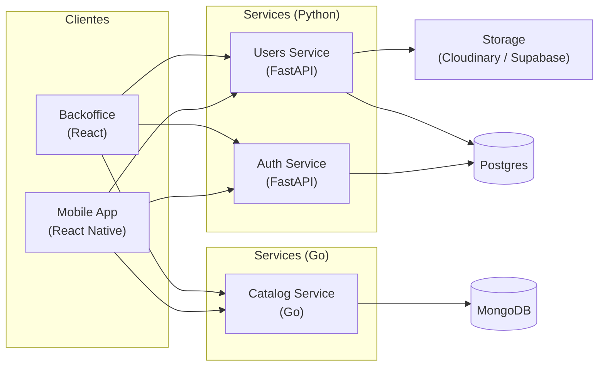
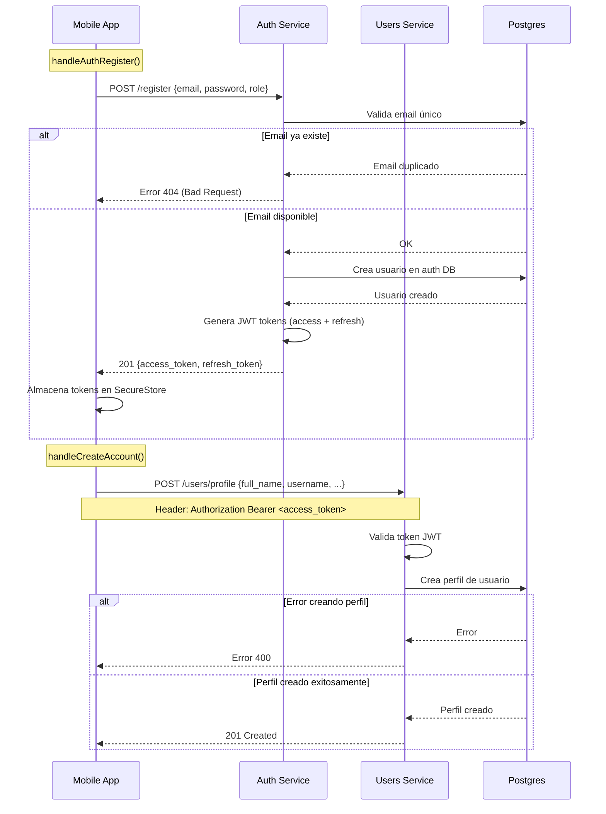

# Bitácora 1

## Alcance

Para el *Checkpoint 1*, el grupo definió inicialmente los siguientes objetivos:

* [x] Registro de usuarios
* [x] Inicio de sesión con email y contraseña
* [x] Catálogo – exploración y búsqueda de contenido
* [x] Visualización de perfil propio
* [x] Edición de perfil
* [x] Visualización de perfil de otros usuarios
* [x] Listado de usuarios del sistema
* [ ] Creación y gestión de playlists

Durante el desarrollo, y a medida que se avanzó con las funcionalidades planificadas, se consensuó un ajuste en el alcance original. En lugar de implementar la creación y gestión de playlists, se decidió priorizar funcionalidades que complementen mejor el conjunto actual. En particular, se incorporaron las siguientes:

* [x] Bloqueo de usuarios
* [x] Recuperación de contraseña

## Artefactos

La plataforma está compuesta por los siguientes artefactos principales:

* **Authentication Service**
* **Users Service**
* **Catalog Service**
* **Servidor web de backoffice (frontend)**
* **Aplicación móvil para usuarios**

Cada uno de estos desarrollado en su propio repositorio privado dentro de nuestra organización de GitHub ["Melodia-ID2"](https://github.com/Melodia-ID2). Cada uno de ellos se detalla a continuación:

### Authentication service

**Tecnología**: FastAPI (Python) + SQLModel + PostgreSQL

Componente encargado del proceso de autenticación de usuarios. Maneja todas las operaciones relacionadas con:

* **Autenticación**: Registro, login y logout de usuarios y administradores.
* **Gestión de tokens**: Emisión y validación de tokens JWT para acceso y refresh.
* **Recuperación de contraseña**: Generación y validación de tokens para restablecimiento de contraseña.
* **Gestión de emails**: Envío de correos electrónicos para verificación de email y recuperación de contraseña.
* **Bloqueo de usuarios**: Permite a los administradores bloquear y desbloquear cuentas de usuario.

### Users service

**Tecnología**: FastAPI (Python) + SQLModel + PostgreSQL

El Users Service es responsable de gestionar toda la información relacionada con los usuarios del sistema, incluyendo:

* **Perfiles de usuario**: Creación, actualización y eliminación de perfiles de usuario.
* **Gestión de fotos de perfiles**: Permite a los usuarios subir y actualizar sus fotos de perfil.
* **Visualización de perfiles**: Permite a los usuarios ver su propio perfil y a los administradores ver los perfiles de todos los usuarios o de alguno en particular.
* **Actualización de roles**: Permite a los administradores cambiar el rol de un usuario (de oyente a artista y viceversa).
* **Validación de tokens**: Verifica la validez de los tokens JWT emitidos por el Auth Service.

### Catalog service

El catalog Service es responsable de gestionar el contenido disponible en la plataforma, incluyendo:
* **Visualización de contendio**: Permite al usuario administrador visualizar la información referente a cada canción, abarcando:
  * El tipo
  * El título
  * El artista principal
  * La colección,(para canciones) 
  * El estado efectivo (programado/publicado/no-disponible-región/bloqueado-admin)
  * La fecha de publicación.
* **Bloqueo contenido**: Permite al administrador bloquear y debloquear canciones y colecciones.
* **Detalle de contenido**: Permite al adminitrados abrir el detalle de una canción/contenido
* **Edición de disponibilidad**: Permite al administrador modificar la lista de regiones donde el contenido se encuentra disponible, que actualmente conforma los metadatos editables de cada contenido.
* **Búsqueda de contenido**: Permite al administrador buscar contenido por título, artista, colección. 
* **Personalización de visualización de contenido**: Permite al administrador modificar las características del contenido que se le muestra, filtrando y/o ordenando por criterios generale o personalizados basados en las carcateristicas visualizables de los ítem mostrados.

### Servidor web frontend de backoffice

**Tecnología**: Next.js (React) + TypeScript + TailwindCSS

Componente web utilizado por los administradores para gestionar el sistema. Permite:

* **Gestión de usuarios**: Visualización, bloqueo/desbloqueo y cambio de roles de usuarios.
* **Gestión de catálogo**: Visualización, búsqueda y edición del contenido del catálogo del sistema.
* **Autenticación**: Login para administradores con persistencia de sesión.

**Características técnicas:**
* Componentes reutilizables con TypeScript
* Estilizado con Tailwind CSS
* Deployed en Vercel

### Aplicación móvil para usuarios

**Tecnología**: React Native + Expo + Typescript

Aplicación móvil para Android para usuarios finales, con las siguientes funcionalidades:
* **Autenticación**: Registro, login y logout de usuarios con validación de email y recuperación de contraseña.
* **Perfil de usuario**: Visualización y edición de perfil propio, con subida de fotos para la foto de perfil.
* **Navegación**: Stack y tab navigation con React Navigation.

**Características técnicas:**
- Desarrollo con Expo para facilitar el proceso de development.
- Soporte para Android.

## Arquitectura del sistema

### Arquitectura interna de servicios

**Backend (Arquitectura en capas)**:
Todos los servicios backend siguen una arquitectura en capas bien definida que separa responsabilidades:

- **Routers** (`/api`): Definición de endpoints y validación de entrada
- **Controllers**: Manejo de requests HTTP, validación de autenticación/autorización  
- **Services** (`/services`): Lógica de negocio y orquestación de operaciones
- **Repositories** (`/repositories`): Acceso a datos y queries a la base de datos

Esta separación facilita el testing, mantenimiento y escalabilidad de cada servicio.

**Frontend (Convenciones React):**
Tanto la aplicación móvil como el backoffice web siguen las convenciones estándar de React:

- **Componentes funcionales** con hooks para manejo de estado
- **Context API** para estado global (autenticación, tema, etc.)
- **Custom hooks** para lógica reutilizable
- **Separación de concerns** entre UI, lógica de negocio y llamadas a APIs

### Componentes principales

**Frontend:**
- **Aplicación móvil**: React Native con Expo para usuarios finales
- **Backoffice web**: Next.js con React para administradores

**Backend (Microservicios):**
- **Auth Service** (Python)
- **Users Service** (Python)
- **Catalog Service** (Go)

**Infraestructura:**
- **PostgreSQL**: Base de datos principal para Auth y Users services
- **MongoDB Atlas**: Base de datos para el Catalog service
- **Cloudinary**: Almacenamiento de imágenes (fotos de perfil)
- **Google Cloud Platform**: Despliegue de servicios backend
- **Vercel**: Despliegue del backoffice web

### Comunicación entre servicios

La comunicación es principalmente mediante API REST:
- Los clientes (móvil y web) consumen directamente las APIs de cada serviciomediante middleware.
- No hay comunicación directa entre microservicios.

### Diagrama de arquitectura del sistema 

## Diagramas de flujo

Durante este primer checkpoint desarrollamos varios diagramas de flujo para guiarnos en el desarrollo de las distintas funcionalidades y asegurar que todos tuvieramos la misma base de entendimiento. Acá documentamos los principales flujos que ya están funcionando:

### Registro de Usuario

Como mencionamos anteriormente, decidimos implementar dos microservicios separados: uno de **autenticación** y otro de **usuarios**. La separación de responsabilidades (por el momento) quedó definida así:

* **Auth Service**: maneja todo lo relacionado con autenticación (login, logout, refresh tokens, recuperación de contraseña)
* **Users Service**: gestiona perfiles de usuario, información personal y relaciones entre usuarios

Esta arquitectura explica por qué el registro está dividido en dos endpoints. Desde la perspectiva del usuario final este proceso es transparente, pero internamente ocurre lo siguiente:

1. **Primera llamada** a `POST /register` en el Auth Service con email, contraseña y rol
2. **Si es exitosa**, se devuelve un `access_token` que debe incluirse como Authorization Header
3. **Segunda llamada** a `POST /users/profile` en el Users Service para completar el perfil

Una decisión importante fue incluir el **rol en el JWT**. Esto nos permite evitar consultas frecuentes a la base de datos para verificar permisos, ya que la validación de roles es algo que ocurre constantemente en el sistema.

Durante el desarrollo de este checkpoint nos encontramos con algunos **desafíos con esta separación**. En varias ocasiones (especialmente para funcionalidades del backoffice/admin) hubiera sido más sencillo tener un solo microservicio. Sin embargo, decidimos mantener la separación porque creemos que cada servicio tiene responsabilidades bien definidas y diferentes, lo que nos facilitará el mantenimiento y escalabilidad a largo plazo.

## Decisiones técnicas

Durante este checkpoint, el equipo debió tomar decisiones que no resultaron triviales. Estas requirieron un análisis previo, discusión interna y el consejo de los tutores. A continuación detallamos dos decisiones que consideramos relevantes.

### Infraestructura empleada para el restablecimiento de contraseña

En relación con la historia de usuario de recuperación de contraseña, con el siguiente criterio de aceptación:

>* **Recuperación de contraseña: [Restablecimiento de contraseña con enlace válido](https://ingenieria-del-software-2.github.io/tps/2025/2/tpgrupal/#recuperaci%c3%b3n-de-contrase%c3%b1a:~:text=CA%202%3A%20Restablecimiento%20de%20contrase%C3%B1a%20con%20enlace%20v%C3%A1lido)**
>
>   * *Dado un usuario que hace clic en el enlace de restablecimiento de contraseña recibido por correo electrónico*
>
>   * *Entonces se le presenta una página segura donde puede ingresar una nueva contraseña.*

El equipo decidió implementar la página segura para el restablecimiento de contraseña dentro del mismo dominio de la página web ya desplegada (la utilizada para el backoffice).

Antes de llegar a esta conclusión, se evaluaron otras alternativas:

1. **Implementar la página dentro de la aplicación móvil.**

   * Descartada porque, si el usuario abre el enlace desde un dispositivo diferente (PC, tablet, etc.), no podría acceder a la aplicación móvil para completar el proceso.

2. **Crear un sitio web independiente exclusivamente para la recuperación de contraseña.**

   * Descartada porque implicaba un nuevo proyecto, con el costo de desarrollo y despliegue adicional que consideramos innecesario para este caso.

La decisión final se basó en la simplicidad de la integración con la opción elegida y en las desventajas de las alternativas. Además, al discutirlo con los tutores, ellos coincidieron en que la solución adoptada era la más conveniente, teniendo en cuenta tanto la complejidad de implementación como las restricciones de tiempo.

### Estrategia de testeo para funcionalidades externas

En relación con las siguientes historias de usuario y criterios de aceptación:

>* **Recuperación de contraseña: [Solicitud de restablecimiento exitosa](https://ingenieria-del-software-2.github.io/tps/2025/2/tpgrupal/#recuperaci%c3%b3n-de-contrase%c3%b1a:~:text=Solicitud%20de%20restablecimiento%20de%20contrase%C3%B1a%20exitosa)**
>
>   * *Dado un usuario registrado que ha olvidado su contraseña*
>   * *Entonces el usuario recibe un correo electrónico con un enlace para restablecer su contraseña.*

>* **Edición de perfil: [Cambio de foto de perfil](https://ingenieria-del-software-2.github.io/tps/2025/2/tpgrupal/#recuperaci%c3%b3n-de-contrase%c3%b1a:~:text=Cambio%20de%20foto%20de%20perfil)**
>
>   * *Dado un usuario autenticado que edita su perfil*
>   * *Entonces el usuario puede subir una nueva foto de perfil.*

El equipo se encontró con la dificultad de testear funcionalidades externas involucradas, como:

* **El envío real de correos electrónicos.**
* **La interacción con servicios de almacenamiento en la nube para la gestión de imágenes.**

Decidimos **no realizar pruebas integrales con los servicios reales**, principalmente por dos razones:

1. **Limitaciones de uso y costos asociados**: los proveedores imponen cuotas (cantidad de requests, espacio de almacenamiento, etc.), lo que dificulta realizar pruebas automatizadas a gran escala.

2. **Alcance de los tests**: se estaría validando el correcto funcionamiento de servicios externos, lo cual escapa a la responsabilidad de nuestro sistema. Nuestro foco es garantizar que se realicen correctamente las llamadas a dichos servicios, no verificar que ellos cumplan su parte.

En consecuencia, la estrategia adoptada fue **mockear estas dependencias externas** durante las pruebas, validando que nuestro sistema:

* Genere las solicitudes correctamente.
* Construya los datos esperados (ejemplo: contenido de los correos).
* Interactúe de forma adecuada con las APIs externas.

De esta manera se mantiene la robustez de los tests sin depender de factores fuera de nuestro control.

## Tecnologías empleadas

* [copilot](https://github.com/copilot)
* [docker](https://www.docker.com/)
* dbeaver-ce (development local)
* [mermaid live editor](https://mermaid.live/)
* [swagger](https://swagger.io/)
* [postman](https://www.postman.com/)
* [supabase](https://supabase.com/) (postgres)
* [cloudinary](https://cloudinary.com/) (storage)
* [docker compose](https://docs.docker.com/compose/)
* react and react-native
* [nodejs](https://nodejs.org/es/)
* [python](https://www.python.org/)
* [golang](https://go.dev/)
* [documentación de expo](https://docs.expo.dev/develop/tools/)
* [fastapi](https://fastapi.tiangolo.com/)
* [mongoDB Atlas](https://www.mongodb.com/es/products/platform/atlas-database)
* [github pages](https://docs.github.com/es/pages) (documentación)
* [google cloud](https://cloud.google.com/?hl=es_419) (deploy)
* [vercel](https://vercel.com/) (deploy)
