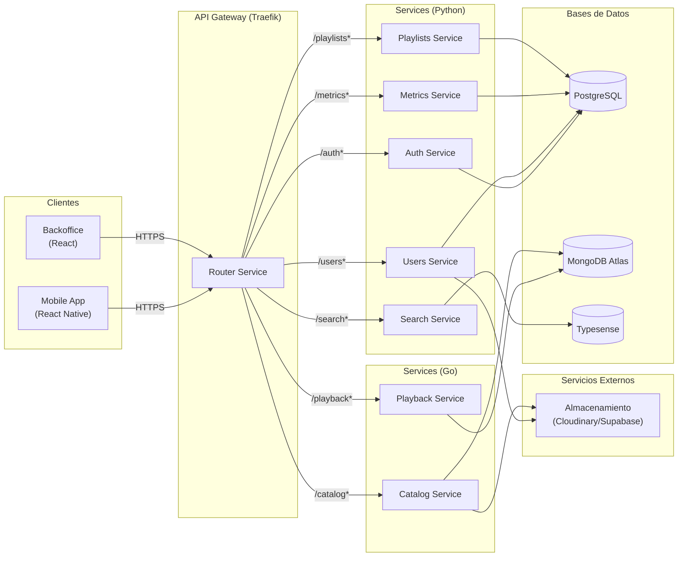

# Bitácora 2

## Alcance

Para el *Checkpoint 2*, el grupo definió inicialmente los siguientes objetivos:

### Historias (prioridad alta)

* [x] [Usuarios] Login con proveedor federado
* [x] [Biblioteca] Creación y gestión de playlists
* [x] [Artistas] Publicación de lanzamientos
* [x] [Artistas] Gestión de perfil del artista
* [x] [Perfil] Visualización de perfil de otros usuarios
* [x] [Reproducción] Gestión de cola
* [x] [Explorar] Búsqueda unificada por tipo de contenido
* [x] [Artistas] Discografía
* [x] [Social] Seguimiento de perfiles de usuario
* [x] [Métricas] Métricas de usuario
* [x] [Biblioteca] Historial de reproducción
* [x] [Administración de contenido] Transiciones y estado efectivo del catálogo
* [x] [Reproducción] Reproducción y controles básicos
* [x] [Biblioteca] Liked Songs

### Historias (prioridad baja)

* [x] [Reproducción] Marcado de Liked Song desde Player
* [x] [Administración de contenido] Bloqueo y desbloqueo con alcance
* [ ] [Administración de contenido] Disponibilidad por región y ventana  <-- **pasa a Checkpoint 3**
* [x] [Administración de contenido] Catálogo - Detalle y trazabilidad
* [ ] [Artistas] Disponibilidad por ventana  <-- **pasa a Checkpoint 3**
* [x] [Artistas] Popular (Top del artista)
* [x] [Artistas] Colaboraciones (Aparece en)
* [x] [Artistas] Perfil del artista
* [ ] [Explorar] Home  <-- **pasa a Checkpoint 3**

### Historias adicionales agregadas durante el checkpoint

* [x] [Reproducción] Reproducción On Demand  (agregada en sprint)

Durante el desarrollo se decidió trasladar a Checkpoint 3 las historias que implican programacion de endpoints, ventanas de disponibilidad y la implementación completa del Home/Explorar, ya que requieren un servicio dedicado para orquestar eventos y ejecuciones a una determinada fecha.

---

## Artefactos

La plataforma está compuesta por los siguientes artefactos principales:

* **Authentication Service**
* **Users Service**
* **Catalog Service**
* **Servidor web de backoffice (frontend)**
* **Aplicación móvil para usuarios**
* **Playlists Service(nuevo)**
* **Playback Service(nuevo)**
* **Metrics Service(nuevo)**
* **Router Service(nuevo)**
* **Search Service(nuevo)**

### Playlists Service (`playlists-service`)

* **Tecnología**: FastAPI (Python) + SQLModel + PostgreSQL

El Playlists Service es responsable de gestionar las relaciones entre los usuarios y los items del catálogo para la creación y persistencia de playlists. Permite:

* Crear, editar y eliminar playlists
* Gestionar la relación entre usuarios y playlists (seguir, dejar de seguir)
* Administrar el contenido de las playlists (agregar/eliminar canciones)
* Obtener playlists por usuario o por ID

### Playback Service (`playback-service`)

* **Tecnología**: Go + MongoDB Atlas

El Playback Service se encarga de controlar la reproducción de cada usuario, ofreciendo:

* Gestión de colas de reproducción
* Historial de reproducción
* Control de la posición actual de reproducción
* Sincronización entre dispositivos

**Endpoints principales**:
- `POST /queue/{user_id}/enqueue`: Añade canciones a la cola
- `GET /songs/{id}/playback`: Obtiene URL firmada para reproducción
- `POST /queue/{user_id}/load`: Reemplaza la cola actual

### Metrics Service (`metrics-service`)

* **Tecnología**: FastAPI (Python) + SQLModel + PostgreSQL

Servicio encargado de recolectar, procesar y exponer métricas de la plataforma:

* **Seguimiento de reproducciones**: Registro de cada reproducción de canción
* **Métricas de artistas**: Oyentes mensuales, ranking
* **Actividad de usuarios**: Eventos como 'me gusta', 'guardar canción', 'seguir usuario'
* **Estadísticas de retención**: Métricas de retención de usuarios
* **Exportación de datos**: En formatos CSV y Excel

**Endpoints principales**:
- `GET /song-plays/{song_id}`: Reproducciones de una canción
- `GET /monthly-listeners/{artist_id}`: Oyentes mensuales por artista
- `GET /user-activity/{user_id}`: Actividad reciente del usuario
- `GET /retention`: Métricas de retención de usuarios

### Router Service (`router-service` / API Gateway)

* **Tecnología**: Traefik

Punto de entrada unificado para todos los servicios de la plataforma:

* **Enrutamiento inteligente**: Distribución de peticiones a los servicios
* **Balanceo de carga**: Entre instancias de los servicios
* **Terminación SSL**: Manejo centralizado de certificados
* **Control de acceso**: Gestión de CORS y autenticación

### Search Service (`search-service`)

* **Tecnología**: Python + Typesense

Motor de búsqueda que proporciona búsqueda rápida y relevante:

* **Búsqueda unificada**: En canciones, artistas, álbumes y playlists
* **Resultados ponderados**: Por relevancia según tipo de contenido
* **Filtrado inteligente**: Según permisos y preferencias del usuario
* **Actualización en tiempo real**: Sincronización con el catálogo principal

---

## Arquitectura y diagramas (resumen)

## Decisiones técnicas tomadas en este checkpoint

1. Introducción de un API Gateway (`router-service`) para centralizar TLS, CORS y routing.
2. Separación del `playback-service` en Go por rendimiento/concurrencia.
3. `search-service` con Typesense para búsqueda rápida y escalable.
4. `metrics-service` dedicado para centralizar eventos y facilitar observabilidad.
5. Se decidió postergar la implementación del worker (ventanas/regiones) en favor de diseñar un `orquestrator-service` en Checkpoint 3.

---

