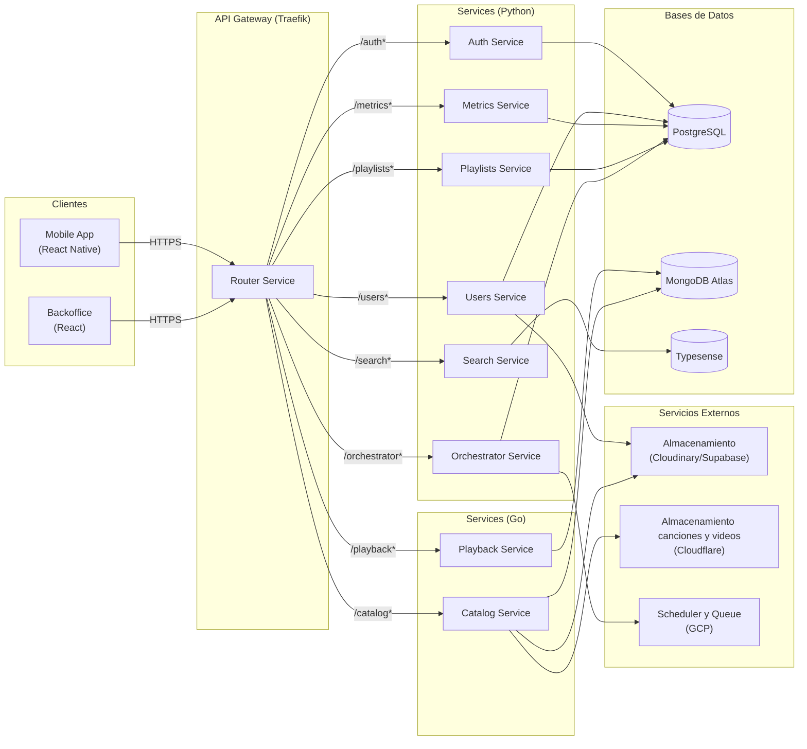

# Bitácora 3

## Alcance

Para el *Checkpoint 3*, el grupo definió inicialmente los siguientes objetivos:

### Historias (prioridad alta)

* [x] [Artistas] Disponibilidad por ventana
* [x] [Administración de Contenido] Disponibilidad por región y ventana
* [x] [Explorar] Home
* [x] [Explorar] Navegación a vistas de detalle
* [x] [Reproducción] Controles avanzados del Player
* [ ] [Reproducción] Videos Musicales Asociados
* [x] [Métricas] Métricas de canciones y álbumes
* [x] [Métricas] Métricas de artistas
* [x] [Biblioteca] Reordenamiento de Contenido en Playlists
* [x] [Biblioteca] Historial de Reproducción
* [x] [Notificaciones] Notificación por nuevo contenido y actividad seguida
* [x] [Notificaciones] Enrutamiento al hacer clic en notificaciones (Deep Link)
* [x] [Social] Compartir Canciones y Playlists
* [x] [Onboarding Usuario] Personalización de Notificaciones Iniciales

### Historias (prioridad baja)

* [x] [Social] Visualización de Actividad de Amigos
* [x] [Onboarding Usuario] Captura Inicial de Géneros Favoritos (Solo el Frontend)
* [x] [Onboarding Usuario] Asistente de Artistas Favoritos (Solo el Frontend)

---

## Artefactos

La plataforma está compuesta por los siguientes artefactos principales:

* **Authentication Service**
* **Users Service** (nuevo: contiene las funcionalidades de notificaciones)
* **Catalog Service**
* **Servidor web de backoffice (frontend)**
* **Aplicación móvil para usuarios**
* **Playlists Service**
* **Playback Service**
* **Metrics Service**
* **Router Service**
* **Search Service**
* **Orchestrator Service(nuevo)**

### Notificaciones en Users Service

Las notificaciones push se implementaron para Android utilizando Firebase Cloud Messaging (FCM) como canal de entrega, con persistencia y preferencia de usuario gestionadas desde el Users Service. La app móvil consume dichas notificaciones vía deep links y ofrece un Centro de Notificaciones con acciones.

#### Tipos de notificación

Se definieron cinco tipos:

- `new_release`: nuevo lanzamiento de un artista que sigo.
- `new_follower`: un usuario nuevo empezó a seguirme.
- `playlist_liked`: un usuario hizo like en una de mis playlists públicas.
- `content_shared`: un usuario me compartió directamente una playlist o una canción.
- `playlist_published`: un usuario que sigo publicó una playlist pública.

Cada notificación incluye `title`, `body`, `image_url` (opcional) y `metadata` con los identificadores relevantes (por ejemplo, `artistId`, `collectionId`, `playlistId`, `followerId`, etc.).

#### Preferencias del usuario (bitfield)

En la tabla `user_account` se creó el campo `preferences` (entero como bitfield) para habilitar/deshabilitar granularmente la recepción por tipo. Mapeo de bits propuesto (LSB → MSB):

- Bit 0: Reservado para el historial de notificaciones.
- Bit 1: `new_release`
- Bit 2: `playlist_published`
- Bit 3: `content_shared`
- Bit 4: `new_follower`
- Bit 5: `playlist_liked`

El Users Service aplica un AND sobre el bitfield del usuario antes de encolar cada envío. En la app, estas preferencias se exponen en Ajustes para que el usuario active/desactive tipos específicos y se guardan de vuelta en el mismo campo.

#### Flujo de emisión (asincrónico)

Cada servicio de dominio es responsable de detectar su evento y solicitar la notificación correspondiente:

1. Servicio emisor detecta el evento (p. ej., Playlists Service publica playlist, Catalog detecta lanzamiento, etc.).
2. El emisor solicita al Orchestrator encolar una tarea con el payload de notificación (endpoint del Users Service).
3. Orchestrator ejecuta la tarea de forma asíncrona y con reintentos.
4. Users Service valida preferencias del destinatario, prepara el payload FCM y lo envía al dispositivo Android del usuario.
5. Users Service persiste la notificación para consulta in‑app (histórico, read/clicked/delete).

#### Entrega a Android (FCM) y deep links

- Transporte: FCM (token del dispositivo registrado por la app Android).
- Deep link: cada payload incluye datos para abrir la vista correcta en la app (colecciones, playlists o perfiles). La app resuelve el esquema definido y enruta con `expo-router`.

Ejemplo de cuerpo lógico usado internamente (simplificado):

```json
{
    "event_type": "content_shared",
    "targetUserIds": ["<user_id>", "..."],
    "title": "Escuchá <contenido> en Melodia!",
    "body": "<actor> te compartió <playlist|canción> <nombre>",
    "image_url": "https://.../cover.jpg",
    "metadata": {
        "sender_id": "<actor_id>",
        "playlistId": "<id>",
        "collectionId": "<id>",
        "content_type": "playlist|song"
    }
}
```

#### Persistencia y API de notificaciones

Users Service expone endpoints REST para consumo móvil (consultar y operar sobre notificaciones):

- `GET /users/notifications?limit&offset&unread_only`
- `PATCH /users/notifications/{id}/read`
- `PATCH /users/notifications/{id}/clicked`
- `PATCH /users/notifications/read-all`
- `DELETE /users/notifications/{id}`
- `GET /users/notifications/unread-count`

La app usa estos endpoints para poblar el Centro de Notificaciones, actualizar estados (leído/clic) y mostrar el badge de no leídas.

#### App móvil: Centro de Notificaciones y UX

- Pantalla dedicada de notificaciones (no modal), con:
    - Menú superior con "Marcar todo como leído" y gesto para cerrar.
    - Ítems swipeables: a la derecha marca como leído (si ya estaba leído, elimina), a la izquierda elimina.
    - Paginación con botón "Cargar más".
- Badge de no leídas en el ícono de campana (con conteo numérico y tope visual).


### Orchestrator Service (`orchestrator-service`)

* **Tecnología**: FastAPI (Python) + SQLModel + PostgreSQL + GCP

El Orchestrator Service es el encargado de ejecutar tareas asincronicas. Tiene dos tipos de operaciones: schedule y enqueue. Es decir, tiene operaciones para programar endpoints genericos con fecha de ejecucion, cantidad de intentos, payload, etc. Por otro lado tambien tiene una queue temporal para encolar y ejecutar endpoints que no necesiten instantaneidad.

---

## Arquitectura y diagramas (resumen)



## Decisiones técnicas tomadas en este checkpoint

1. Introducción de orchestrator service.
2. Para la programación de publicación de contenido, se programa un endpoint que intenta publicar. Esto es para que se pueda editar la fecha programada. Se edita la fecha en catalogo y llegada la fecha se recibe el endpoint programado que intenta publicar si la fecha programada es la correcta
3. Para permitir que usuarios accedan a contenido específico a través de una url externa, se optó por usar deeplinks con un esquema personalizado. En particular, decidimos utilizar el dominio web de Melodia como intermediario para redirigir al usuario hacia vistas concretas de la aplicación. Esta solución se adoptó debido a políticas de seguridad de Google, que impiden devolver una redirección directamente desde el endpoint inicial, ya que no existe un mecanismo fiable para verificar si dicha redirección es maliciosa.
---

