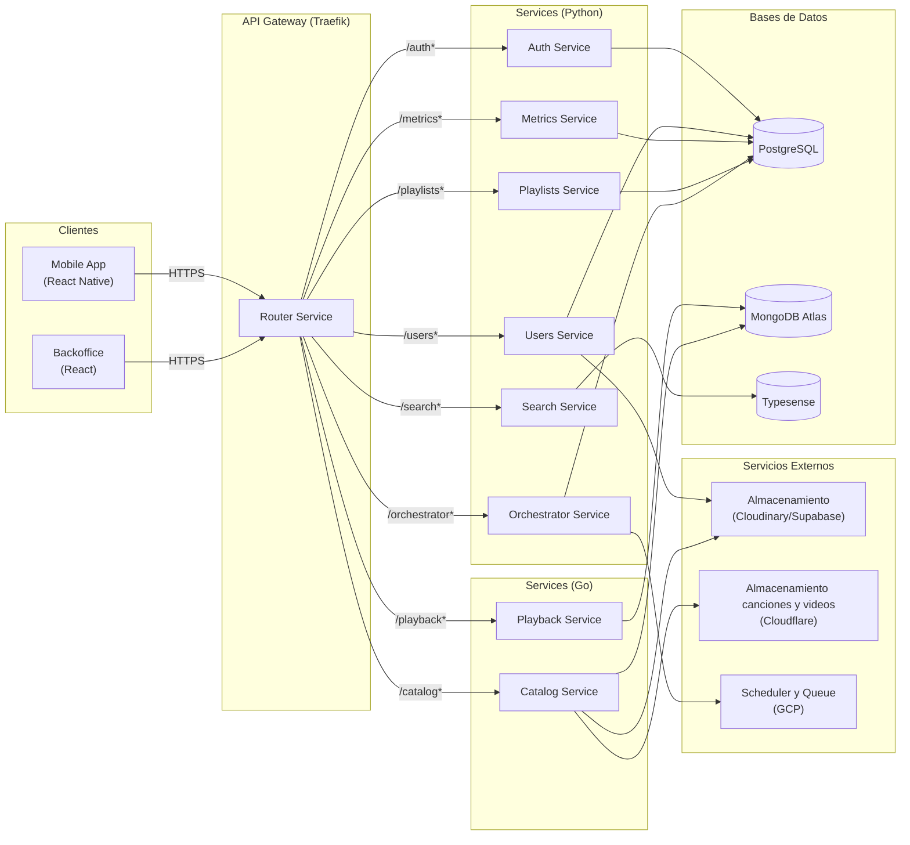

# Bitácora 2

## Alcance

Para el *Checkpoint 2*, el grupo definió inicialmente los siguientes objetivos:

### Historias (prioridad alta)

* [x] [Artistas] Disponibilidad por ventana
* [x] [Administración de Contenido] Disponibilidad por región y ventana
* [x] [Explorar] Home
* [x] [Explorar] Navegación a vistas de detalle
* [x] [Reproducción] Controles avanzados del Player
* [ ] [Reproducción] Videos Musicales Asociados
* [x] [Métricas] Métricas de canciones y álbumes
* [x] [Métricas] Métricas de artistas
* [x] [Biblioteca] Reordenamiento de Contenido en Playlists
* [x] [Biblioteca] Historial de Reproducción
* [x] [Notificaciones] Notificación por nuevo contenido y actividad seguida
* [x] [Notificaciones] Enrutamiento al hacer clic en notificaciones (Deep Link)
* [x] [Social] Compartir Canciones y Playlists
* [x] [Onboarding Usuario] Personalización de Notificaciones Iniciales

### Historias (prioridad baja)

* [x] [Social] Visualización de Actividad de Amigos
* [x] [Onboarding Usuario] Captura Inicial de Géneros Favoritos (Solo el Frontend)
* [x] [Onboarding Usuario] Asistente de Artistas Favoritos (Solo el Frontend)

---

## Artefactos

La plataforma está compuesta por los siguientes artefactos principales:

* **Authentication Service**
* **Users Service**
* **Catalog Service**
* **Servidor web de backoffice (frontend)**
* **Aplicación móvil para usuarios**
* **Playlists Service**
* **Playback Service**
* **Metrics Service**
* **Router Service**
* **Search Service**
* **Orchestrator Service(nuevo)**

### Orchestrator Service (`orchestrator-service`)

* **Tecnología**: FastAPI (Python) + SQLModel + PostgreSQL + GCP

El Orchestrator Service es el encargado de ejecutar tareas asincronicas. Tiene dos tipos de operaciones: schedule y enqueue. Es decir, tiene operaciones para programar endpoints genericos con fecha de ejecucion, cantidad de intentos, payload, etc. Por otro lado tambien tiene una queue temporal para encolar y ejecutar endpoints que no necesiten instantaneidad.

---

## Arquitectura y diagramas (resumen)

## Decisiones técnicas tomadas en este checkpoint

1. Introducción de orchestrator service.
2. Para la programación de publicación de contenido, se programa un endpoint que intenta publicar. Esto es para que se pueda editar la fecha programada. Se edita la fecha en catalogo y llegada la fecha se recibe el endpoint programado que intenta publicar si la fecha programada es la correcta
3. Para permitir que usuarios accedan a contenido específico a través de una url externa, se optó por usar deeplinks con un esquema personalizado. En particular, decidimos utilizar el dominio web de Melodia como intermediario para redirigir al usuario hacia vistas concretas de la aplicación. Esta solución se adoptó debido a políticas de seguridad de Google, que impiden devolver una redirección directamente desde el endpoint inicial, ya que no existe un mecanismo fiable para verificar si dicha redirección es maliciosa.
---

