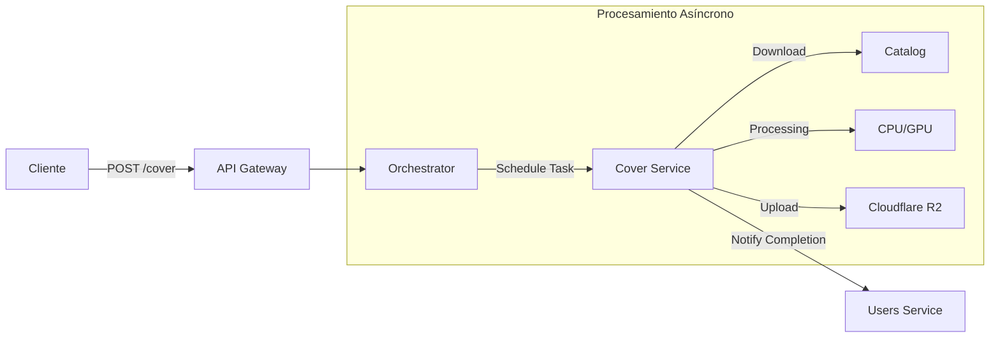

# Bitácora 4

## Alcance

Para el *Checkpoint 4*, el enfoque principal del equipo fue la implementación de una funcionalidad innovadora y técnicamente desafiante que excediera los requisitos básicos del proyecto.

### Historias (Features Adicional)

*   [x] **Servicio de Generación de Covers con IA**: Implementación de un pipeline completo para separar stems de canciones y reemplazar la voz original con modelos de IA (RVC).
*   [x] **Integración Cloud**: Almacenamiento de modelos y resultados en Cloudflare R2.

---

## Artefactos

Se incorporaron nuevos servicios al ecosistema de Melodia:

*   **Cover Service**: Microservicio Python encargado del procesamiento de audio (separación, conversión, mezcla).
*   **Orchestrator Service**: Servicio encargado de gestionar tareas asíncronas y la comunicación entre servicios para procesos largos.

---

## Arquitectura

La arquitectura se expandió para soportar el procesamiento intensivo de audio:

---

## Desarrollo del Cover Service (La Travesía)

A continuación, documentamos el proceso de desarrollo de este servicio, que presentó desafíos técnicos significativos.

### 🎯 Objetivo del Proyecto

Desarrollar un servicio que permita crear covers musicales utilizando modelos de voz de artistas famosos mediante RVC (Retrieval-based Voice Conversion), separación de stems con Demucs, y procesamiento de audio con librerías especializadas.

### 🚀 Fase 1: Los Inicios Prometedores

#### Primeros Pasos (Todo iba bien... por ahora)

- **Modelos de voz**: Descargados fácilmente desde Hugging Face (Michael Jackson, Freddy Mercury, Gustavo Cerati, The Weeknd).
- **Testing incremental y exitoso**:
  1. ✅ **Paso 1**: Publicar la canción original completa → ✅ Funcionó
  2. ✅ **Paso 2**: Extraer y publicar solo el acapella → ✅ Funcionó
  3. ✅ **Paso 3**: Separar stems (Demucs) y volver a juntar → ✅ Funcionó
  
**Estado**: Todo marchaba sobre ruedas. El pipeline básico de separación y mezcla funcionaba perfectamente.

### 💥 Fase 2: El Infierno de las Dependencias

#### La Pesadilla de RVC

Cuando intentamos agregar los **modelos de conversión de voz (RVC)**, comenzó el caos:

**El Efecto Cascada**:
RVC necesita `torch==2.3.1` → `numpy<1.25` → `fairseq` (necesita numpy>=1.21,<1.24) → `hydra-core` → `omegaconf` (CONFLICTO con dataclasses de Python 3.12). Además, `faiss-gpu` requiere CUDA específico incompatible con el torch instalado.

**Resultado**: Días enteros resolviendo conflictos de dependencias, solo para encontrar nuevos conflictos.

### 🎮 Fase 3: La Búsqueda de GPU

#### Plan Original: Google Cloud Run con GPU

**Objetivo**: Deployar en GCR aprovechando los créditos gratuitos.
**Problema**: GCR NO permite usar GPU sin billing account verificado (restricción anti-fraude).
**Estado**: Plan A descartado. Sin GPU local disponible para testing.

### 🔬 Fase 4: Google Colab - La Solución Temporal

Intentamos trabajar en Colab, pero el entorno tenía conflictos masivos con las dependencias de RVC y cada reinicio requería reinstalar todo. Fue demasiado inestable.

### ⚡ Fase 5: Lightning AI - El Héroe Inesperado

Descubrimos Lightning AI, que fue un game-changer:
1.  **CPU Súper Potente**: Debugging rápido (contenedor levanta en 10s vs 5min local).
2.  **GPU para Testing**: NVIDIA A10/T4 disponible. Conversión en ~2 minutos.

**Cómo lo usamos**: Desarrollo en CPU rápida, Testing en GPU.

### 🚀 Fase 6: Script de Deploy en Lightning AI

Creamos `lightning_deploy.sh` que levanta el contenedor y expone el servicio vía **ngrok**. Esto nos permitió tener un entorno de "producción" on-demand con GPU para demos.

### 🌩️ Fase 7: De Vuelta a Google Cloud Run

#### El Problema del Startup Timeout

Al intentar deployar en GCR (CPU), el contenedor fallaba porque tardaba 15 minutos en descargar los modelos, superando el timeout default de 4 minutos.

**Solución**: Deploy en 2 fases.
1.  Deploy "Mini" (sin modelos) para que arranque rápido.
2.  Configurar **Startup Probe** con timeout extendido (20 min).
3.  Deploy "Completo" (con modelos).

**Resultado**: Servicio deployado exitosamente en GCR (CPU). Tarda ~15 min en procesar una canción, pero es gratis y 24/7.

### 🧪 Fase 8: El Dilema del Testing

Intentamos implementar tests automatizados con mocks, pero nos enfrentamos a los mismos problemas de dependencias (pytest importando módulos que requieren CUDA).

**Decisión**: No implementar tests automatizados unitarios para el procesamiento de audio.
**Razones**: Relación costo-beneficio negativa (tests frágiles, cobertura baja), dependencias inmanejables, y el hecho de que es un servicio adicional.
**Estrategia**: Testing manual exhaustivo en Lightning AI y monitoring en producción.

---

## Decisiones Técnicas

### 1. Estrategia de Despliegue Híbrida

Se decidió mantener dos entornos de despliegue con propósitos diferentes:

*   **Google Cloud Run (CPU)**: Para disponibilidad 24/7 y bajo costo. Ideal para usuarios que pueden esperar ~15 minutos por su cover.
*   **Lightning AI (GPU)**: Para demostraciones y procesamiento de alta velocidad (~2 min). Se activa bajo demanda.

### 2. Gestión de Modelos con Cloudflare R2

Debido al gran tamaño de los modelos de voz (>400MB cada uno), se decidió no incluirlos en la imagen de Docker ni en el repositorio git. En su lugar:
*   Se almacenan en un bucket de **Cloudflare R2** (compatible con S3).
*   Se descargan al iniciar el contenedor mediante un script `init_models.py`.
*   Se implementó lógica de caché local y "force redownload" para facilitar actualizaciones.

---

## Tecnologías Empleadas

*   **RVC (Retrieval-based Voice Conversion)**: Core de la clonación de voz.
*   **Demucs**: Separación de pistas de audio.
*   **FFmpeg**: Procesamiento y mezcla.
*   **Cloudflare R2**: Almacenamiento de objetos (modelos y resultados).
*   **Lightning AI**: Infraestructura de GPU on-demand.
*   **Google Cloud Run**: Hosting serverless.
*   **Docker**: Estandarización del entorno complejo.
