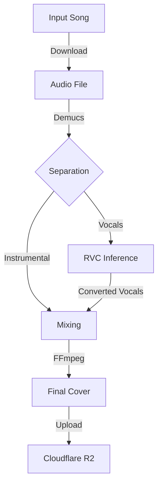

# Servicio de Cover IA

**Estado**: Beta  
**Tecnología**: Python (FastAPI) + RVC + Demucs  
**Repositorio**: [melodia-cover-service](https://github.com/Melodia-ID2/melodia-cover-service)

---

## Descripción General

El **Cover Service** es un microservicio encargado de generar "covers" (versiones) de canciones utilizando Inteligencia Artificial. Permite tomar una canción existente, separar sus componentes (voz e instrumental) y reemplazar la voz original con un modelo de voz entrenado (ej. Michael Jackson, Gustavo Cerati, etc.).

Este servicio fue desarrollado como una funcionalidad **adicional** al alcance original del proyecto, con el objetivo de explorar tecnologías de procesamiento de audio y ML.

---

## Arquitectura Interna

El servicio sigue un pipeline de procesamiento secuencial:

1.  **Descarga**: Obtiene el audio original desde el proveedor (Catalog/Cloudflare).
2.  **Separación (Demucs)**: Utiliza `htdemucs` para separar el audio en `vocals.wav` y `no_vocals.wav` (instrumental).
3.  **Conversión (RVC)**: Procesa `vocals.wav` utilizando un modelo RVC (Retrieval-based Voice Conversion) seleccionado.
4.  **Mezcla (FFmpeg)**: Combina la voz convertida con el instrumental original.
5.  **Publicación**: Sube el resultado a Cloudflare R2 y notifica al Catalog Service.

### Diagrama del Pipeline



---

## Tecnologías Clave

*   **FastAPI**: Framework web para la API REST.
*   **Demucs**: Librería de Meta para separación de fuentes de audio (SOTA).
*   **RVC (Retrieval-based Voice Conversion)**: Tecnología core para la clonación de voz.
*   **PyTorch**: Motor de tensor para los modelos de ML.
*   **FFmpeg**: Procesamiento y mezcla de audio.
*   **Docker**: Contenerización del entorno (crítico debido a las dependencias complejas).

---

## Estrategia de Despliegue

Debido a los requerimientos de hardware (GPU), implementamos una estrategia híbrida:

1.  **Google Cloud Run (Producción 24/7)**:
    *   Ejecuta en CPU.
    *   Maneja la API y la orquestación.
    *   Procesamiento lento (~15 min/canción) pero gratuito y siempre disponible.
    *   Utiliza `Startup Probe` para permitir la descarga inicial de modelos (que toma tiempo).

2.  **Lightning AI (On-Demand)**:
    *   Ejecuta en GPU (NVIDIA T4/A10).
    *   Se levanta bajo demanda para demos o procesamiento masivo.
    *   Procesamiento rápido (~2 min/canción).
    *   Expuesto vía `ngrok`.

---

## API Reference

### Crear Cover

```http
POST /cover
```

**Body:**
```json
{
  "song_id": "string",
  "voice_model": "string" // ej: "michael_jackson"
}
```

### Listar Modelos

```http
GET /models
```

Devuelve la lista de modelos de voz disponibles y sus características.

---

## Limitaciones Conocidas

*   **Tiempo de procesamiento en CPU**: Sin GPU, la separación y conversión son procesos intensivos.
*   **Dependencias**: El entorno requiere versiones muy específicas de `torch`, `numpy` y `fairseq`.
*   **Copyright**: El servicio es puramente demostrativo y educativo.
